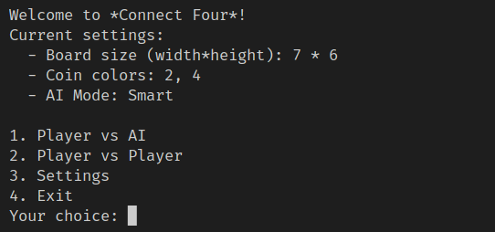
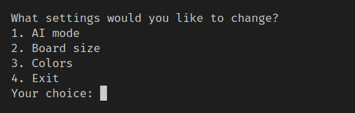
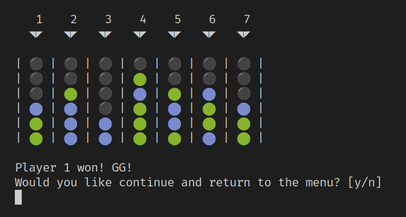
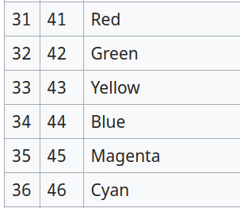

# Connect Four
## A [Connect Four game](https://en.wikipedia.org/wiki/Connect_Four) developed in C++ in the terminal for the PRG1 class.

## Visual overview

### The main menu

### The settings menu

### The game

## Authors
- Samuel Roland
- Mathias Renoult

## How to use
1. Clone the repos: `git clone https://github.com/HEIGVD-PRG1-F-2022/lab-03-puissance-4-team-samuel-r-mathias-r.git`
1. Compile the project: `g++ *.cpp -o ./main`
1. Execute the binary: `./main`

## Technical details
We used [4 bits ANSI colors](https://en.wikipedia.org/wiki/ANSI_escape_code#3-bit_and_4-bit), and we store their values from 1 to 6 in `settings.colors`.  

## Review of the teacher
The code review and faculative grade is available here: https://github.com/HEIGVD-PRG1-F-2022/lab-03-puissance-4-team-samuel-r-mathias-r/pull/1